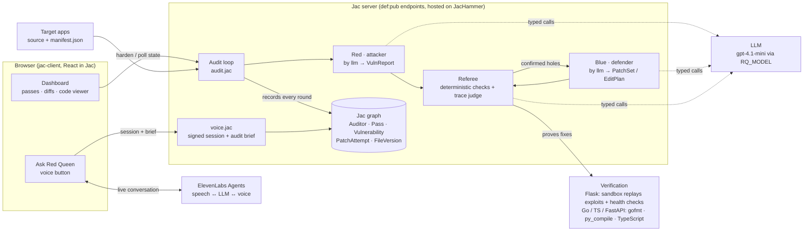

# Red Queen

**An attacker agent breaks your web app. A defender agent fixes the code. A referee proves each fix. Repeat until a scan comes back clean.**

Point Red Queen at a web app (one file or many, Python, Go, TypeScript or FastAPI) and press **Harden this codebase**. You watch it play out round by round:

1. **Red** (attacker) reads the source and finds requests that leak another user's data, secrets, or let a normal user do admin-only things.
2. **The referee** confirms each hole is real before anything gets fixed.
3. **Blue** (defender) patches the code, at most two holes per round.
4. **The referee** checks every patch: the exploit must stop working *and* the app must keep working for legitimate users. A bad patch is thrown away and Blue tries again.
5. Red scans the patched code again. When a scan finds nothing, the app is **clean**.

Ask **"Ask Red Queen"** (ElevenLabs voice agent) anything about what's on screen, like *"what did you find?"* or *"how did Blue fix it?"*, and it explains it out loud in plain English.

Built in [Jac](https://jac-lang.org) for JacHacks A2Tech 2026.

---

## How fixes are verified

This is the part we care most about: Red Queen never takes an agent's word for it.

| App type | How a hole is confirmed and a fix is proven |
|---|---|
| **Python / Flask** (`target/`, `targets/bookclub`) | **Live exploit.** Each app runs in a sandboxed subprocess with a fresh random secret. A hole counts only if the request actually returns the secret. A fix counts only if that exploit *and every earlier one* now fail, and the app's health checks (e.g. "alice can still read her own notes") still pass. |
| **Go, TypeScript, FastAPI** (`testsites/apps/*`) | **Compile + code-tracing referee.** We can't run these in-process, so Blue's patch must apply cleanly and pass the language's own parser (`gofmt`, `py_compile`, TypeScript), and a separate referee traces the exact request through the patched handler. Labeled in the UI as "checked by re-scan, not live exploit." |

## Architecture

Everything the agents do lives on a **Jac graph**: an `Auditor` node with one `Pass` node per round (findings, Blue's summary, per-file diffs, verdicts), and the working copy of the code that each accepted patch advances.



More diagrams (one hardening round, the graph schema): [docs/ARCHITECTURE.md](docs/ARCHITECTURE.md). PNG versions are in `docs/img/`.

- **Agents are typed `by llm` functions** that return structured objects (`VulnReport`, `PatchSet`, `EditPlan`, `HoleCheck`), not free text.
- **The referee is deterministic** wherever possible: sandboxed exploit replay, health checks, syntax checks.
- **Bad patches never go live.** A patch that breaks the app, doesn't close a hole, doesn't apply, or doesn't compile is rejected; Blue gets one retry with the referee's reason, and otherwise the code is left unchanged.
- **In the original single-file game mode** (`arena.jac`), Blue's edit is confined to the exploited function (AST splice), and patches that try `os.system`, `eval`, `subprocess`, etc. are blocked.
- **Targets are drop-in:** a folder with the source plus a `manifest.json` (entry file, users, a secret hint, health checks, and a plain-words access `policy`).

| File | What it does |
|---|---|
| `audit.jac` | The harden loop: Red, Blue, referee, passes on the graph, dashboard state |
| `codecheck.jac` | Applies Blue's find/replace edits; per-language syntax checks |
| `sandbox.jac`, `sandbox/runner.py`, `sandbox/edit.py` | Runs a Flask target in a subprocess, fires exploits, runs health checks, AST splicing and safety scan |
| `attacker.jac`, `defender.jac`, `referee.jac`, `arena.jac` | The original single-file Red-vs-Blue game engine |
| `config.jac` | Target selection, manifests, access policies |
| `llm.jac` | One `RQ_MODEL` setting for every agent |
| `voice.jac`, `components/VoiceGuide.jac` | ElevenLabs "Ask Red Queen" voice agent |
| `components/*.jac` | Dashboard UI (Jac client components) |

About three quarters of the code is Jac.

## Demo sites

| Site | Stack | Planted holes |
|---|---|---|
| ledgerly | Flask, 1 file | invoice IDOR, missing admin check, debug page leaking config |
| Book Club | Flask, 5 files | read anyone's notes, member export of all notes, anyone's reading list, `/status` leaking runtime config |
| Task Board | TypeScript / Express | read, delete and list other users' tasks |
| Support Portal | Python / FastAPI | unauthenticated export, service token in account response, rename others' tickets, user lookup returning password hashes |
| Deployment Dashboard | Go | debug endpoint leaking the admin password, non-admin deletes, session-token listing |

The three `testsites/apps` are real, runnable apps (Docker, see `testsites/README.md`), all with synthetic data.

## Run it

Requires [Jac](https://jac-lang.org) `0.37.23`.

```sh
git clone https://github.com/pranavnandyalam/jachacks.git red-queen && cd red-queen
jac install                        # Python + npm deps from jac.toml
npm install --prefix tools         # TypeScript syntax checker (optional)
```

Create `.env` (git-ignored):

```sh
OPENAI_API_KEY=sk-...
RQ_MODEL=openai/gpt-4.1-mini       # any litellm model string; unset = local ollama model
ELEVENLABS_API_KEY=sk_...          # optional, for the voice agent (needs Agents write access)
```

Start the server and open http://localhost:8000:

```sh
JAC_DB_RO_UNITS=0 jac run --no-dev main.jac
```

Pick a site from **Example app** and press **Harden this codebase**. A full run takes about 10 to 70 seconds.

To set up the voice agent's prompt on your own ElevenLabs agent, set `ELEVENLABS_AGENT_ID` and run `python3 scripts/setup_voice_agent.py`.

Tests: `jac test <file>.jac` for each module (e.g. `jac test audit.jac`), plus `jac check` for types.

## Honest limits

- **The sandbox is a subprocess plus a static blocklist**, not a container. Fine for demo targets; don't point it at untrusted code on a machine you care about.
- **Non-Flask fixes aren't verified by a live exploit.** The code-tracing referee is an LLM and can be wrong; when Blue re-reads a flagged route and finds nothing to change, the flag is marked reviewed rather than open.
- **Red is an LLM, so recall varies run to run.** It usually finds every planted hole; occasionally one slips to a later pass or a later run.
- **Agents run on a hosted LLM** (`gpt-4.1-mini` by default, about 1 to 2 cents per run). A local ollama model also works, just slower.

## Team

<!-- TODO: add names and roles -->
