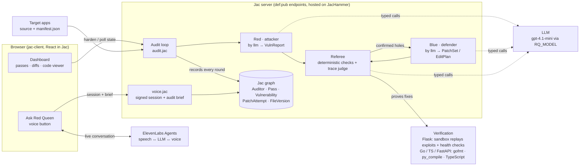
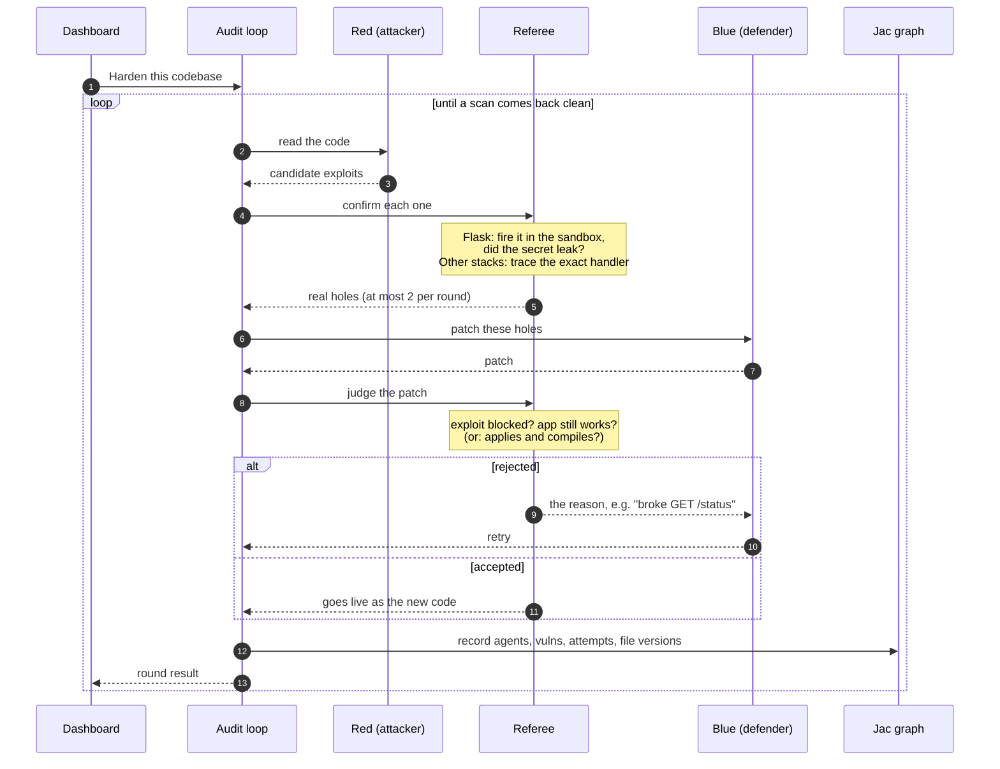
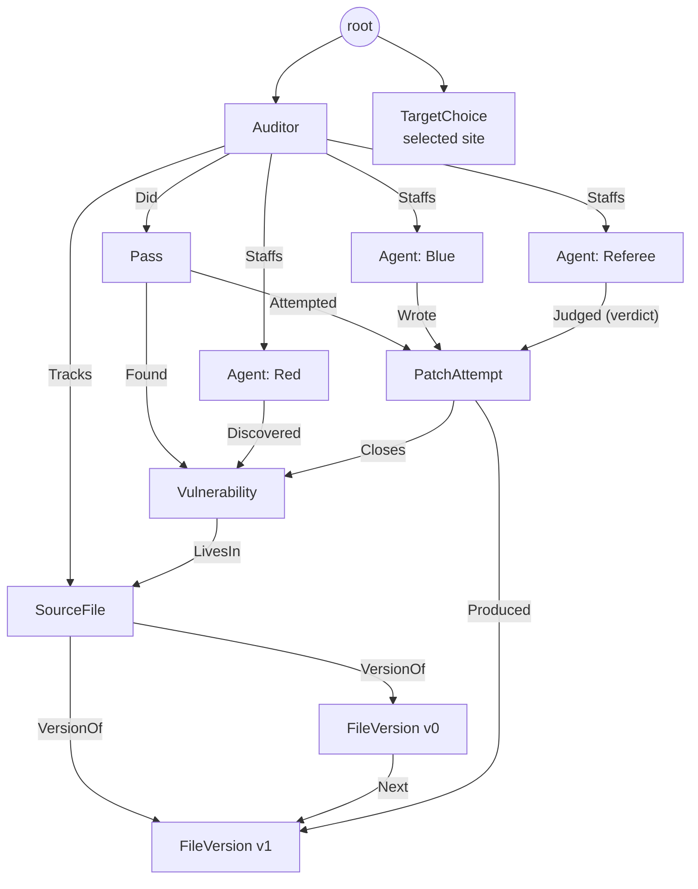

# Red Queen architecture

## 1. System overview

```mermaid
flowchart LR
    subgraph Browser["Browser (jac-client, React in Jac)"]
        UI["Dashboard<br/>passes · diffs · code viewer"]
        Voice["Ask Red Queen<br/>voice button"]
    end

    subgraph Server["Jac server (def:pub endpoints, hosted on JacHammer)"]
        Loop["Audit loop<br/>audit.jac"]
        Red["Red · attacker<br/>by llm → VulnReport"]
        Blue["Blue · defender<br/>by llm → PatchSet / EditPlan"]
        Ref["Referee<br/>deterministic checks + trace judge"]
        Graph[("Jac graph<br/>Auditor · Pass · Vulnerability<br/>PatchAttempt · FileVersion")]
        VoiceAPI["voice.jac<br/>signed session + audit brief"]
    end

    Verify["Verification<br/>Flask: sandbox replays exploits + health checks<br/>Go / TS / FastAPI: gofmt · py_compile · TypeScript"]

    LLM["LLM<br/>gpt-4.1-mini via RQ_MODEL"]
    Eleven["ElevenLabs Agents<br/>speech ↔ LLM ↔ voice"]
    Targets["Target apps<br/>source + manifest.json"]

    UI -- "harden / poll state" --> Loop
    Loop --> Red --> Ref
    Ref -- "confirmed holes" --> Blue --> Ref
    Red & Blue & Ref -. "typed calls" .-> LLM
    Ref -- "proves fixes" --> Verify
    Loop -- "records every round" --> Graph
    Targets --> Loop
    Voice -- "session + brief" --> VoiceAPI
    VoiceAPI --> Graph
    Voice <-- "live conversation" --> Eleven
```

## 2. One hardening round

```mermaid
sequenceDiagram
    autonumber
    participant D as Dashboard
    participant L as Audit loop
    participant R as Red (attacker)
    participant F as Referee
    participant B as Blue (defender)
    participant G as Jac graph

    D->>L: Harden this codebase
    loop until a scan comes back clean
        L->>R: read the code
        R-->>L: candidate exploits
        L->>F: confirm each one
        Note over F: Flask: fire it in the sandbox,<br/>did the secret leak?<br/>Other stacks: trace the exact handler
        F-->>L: real holes (at most 2 per round)
        L->>B: patch these holes
        B-->>L: patch
        L->>F: judge the patch
        Note over F: exploit blocked? app still works?<br/>(or: applies and compiles?)
        alt rejected
            F-->>B: the reason, e.g. "broke GET /status"
            B-->>L: retry
        else accepted
            F-->>L: goes live as the new code
        end
        L->>G: record agents, vulns, attempts, file versions
        L-->>D: round result
    end
```

## 3. The graph schema

```mermaid
flowchart TD
    root((root)) --> Auditor
    root --> TargetChoice["TargetChoice<br/>selected site"]
    Auditor -- Staffs --> Red[Agent: Red]
    Auditor -- Staffs --> Blue[Agent: Blue]
    Auditor -- Staffs --> Referee[Agent: Referee]
    Auditor -- Did --> Pass
    Auditor -- Tracks --> SourceFile
    SourceFile -- VersionOf --> V0[FileVersion v0]
    SourceFile -- VersionOf --> V1[FileVersion v1]
    V0 -- Next --> V1
    Pass -- Found --> Vuln[Vulnerability]
    Red -- Discovered --> Vuln
    Vuln -- LivesIn --> SourceFile
    Pass -- Attempted --> Patch[PatchAttempt]
    Blue -- Wrote --> Patch
    Referee -- "Judged (verdict)" --> Patch
    Patch -- Closes --> Vuln
    Patch -- Produced --> V1
```
